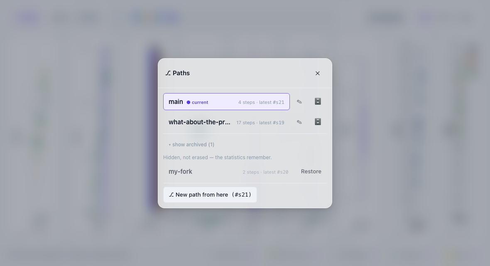
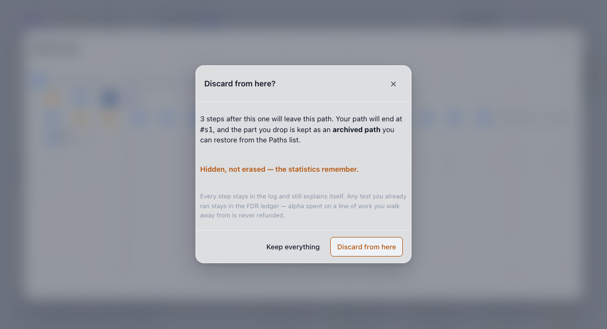
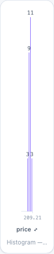
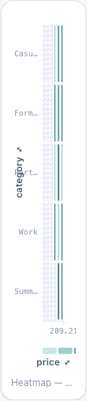
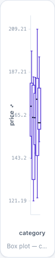

# vizfootprint-ui

The designed, reusable component library for [vizfootprint](../README.md) — a headless
session-view adapter plus React components that render a coordinated, cause-tagged,
branching-provenance dashboard: charts with interactive (re-encodable) axes, a
two-mode time-travel bar, a git-graph branch map with named paths, and the honesty
panels (commit log, online-FDR two-truths ledger, gaps, readiness).

Part of the footprintjs family (the explainable-ui / agentthinkingui pattern):
ESM + UMD bundles, React `>=18` as a peer, one stylesheet, `.d.ts` types.

```
npm run build      # dist/vizfootprint-ui.{js,umd.js,css} + types/
npm test           # vitest (jsdom units + a Playwright gallery smoke)
npm run gallery    # http://localhost:5177 — the cockpit on a scripted real session
```

## The cockpit — the flagship layout

`<VizCockpit>` puts everything on ONE screen; neither the page nor the shell
ever scrolls. Three bands:

- **top strip** — time travel: the compact `<TimeTravelBar>` (Explore/Present
  toggle, the commit timeline, and the ⚑ bookmark button).
- **charts** — fill ALL remaining height. Each chart is a render prop that
  receives its cell's measured size (`<ChartFrame>` does the measuring), so the
  SVG viewBox matches the on-screen box 1:1 — charts scale with the window and
  stay crisp.
- **status strip** — one slim line: a status readout on the left (rows
  selected, provider label), REPORT CHIPS on the right. Each chip carries a
  live badge (commits, discoveries, gap count …) so state is glanceable while
  closed, and opens a large frosted-glass modal hosting the full panel
  (`CommitLog`, `BranchMap`, `FdrLedger`, `ReadinessPanel`, `GapsPanel` —
  unchanged). Chips are just data: add your own (e.g. a 🐛 Debug panel).


On narrow screens (≤700px) the charts become horizontally swipeable pages
(CSS scroll-snap with dot indicators); the time strip stays pinned top, the
chip strip pinned bottom — still zero vertical page scroll. The shell sizes
itself with `dvh` units so mobile browser chrome is accounted for.

```tsx
<VizCockpit
  top={<TimeTravelBar compact …adapter wiring… />}
  charts={[
    { id: 'scatter', weight: 3, caption: 'drag to brush',
      render: ({ width, height }) => <VizScatter width={width} height={height} … /> },
    { id: 'bar', weight: 2, render: ({ width, height }) => <VizBar width={width} height={height} … /> },
  ]}
  reports={[
    { id: 'commits', title: 'Commit log', icon: '🧾', badge: state.commits.length,
      content: <CommitLog commits={state.commits} onSeek={(id) => void view.seek(id)} /> },
    { id: 'gaps', title: 'Gaps', icon: '⚠️', badge: state.gaps.length,
      content: <GapsPanel heading={false} gaps={state.gaps} /> },
  ]}
  status={`${selected} of ${total} rows selected · provider: ${provider}`}
  readOnly={mode === 'present'}
/>
```

## Layouts — Flow, Grid, Focus (they time-travel)

The cockpit has three user-pickable arrangements, switched from a small
segmented control in the top strip (keyboard accessible — arrow keys walk it):

- **Flow** — the weighted band above, the default. Nothing changes if you
  never touch the switcher.
- **Grid** — equal cells in two rows. Good for comparing charts at the same
  size.
- **Focus** — one maximized chart over a rail of small live thumbnails.
  Clicking a thumbnail swaps it into the hero spot.

### A cell has a HOME, and a focus change moves exactly two of them

**Every cell has a home slot and never leaves it. The focus is a LIFT, not a
reshuffle: the focused cell is drawn large in the hero, and its home stays
where it is and says so.**

The obvious alternative — a **transposition**, putting the focused cell in slot
0 by swapping it with whatever is there — is provably wrong. From `[P0, P1,
P2]`, focusing `P1` draws `[P1, P0, P2]` and focusing `P2` draws `[P2, P1,
P0]`: that is a **three-cycle**, and `P0`, which nobody touched, has moved. The
reason is structural — *which cell was focused* is history, and a pure function
of (recorded order, focused cell) cannot know it; the escapes are component
state (a visible act that records nothing) or a commit per focus change (which
makes the focus an act and gives one question two owners).

The cockpit had a third model until now, and it was worse than either. The rail
was re-derived by SKIPPING the focused cell, so every cell after it shifted one
column. **Measured on the packaged cockpit with five cells: moving the focus
from the first to the last moved all five, and a focus change moved `|i − j| +
1` cells — a mean of 3.0 of 5 over the ten pairs. It is exactly 2 now, for every
pair** (`ui/src/layout/arrangement.ts` · `cockpitSlots`; pinned by
`VizCockpit.layout.test.tsx` on the rendered grid and by `arrangement.test.ts`
as algebra, including the three-cycle the rejected model produces).

**The price, stated:** the rail needs one home per cell *including the lifted
one*, so it has one more box than there are pictures to draw and the homes
beside it are narrower — five cells give five rail columns where there were
four, each 20% of the band instead of 25%. That is the cost of a reader's
spatial memory of their own dashboard. The trade was made first on a worked
consumer desk (`vizfootprint-demo` · `web/src/workbench/README.md`), which is
where this law and its proof come from.

The cell order itself rides **one codec** (`cellOrderToLayoutValue` /
`cellOrderFromLayoutValue`): the joined string every older trace holds whenever it
survives its own round trip, JSON when it would not — so a chart id containing a
comma round-trips instead of coming back as two cells, and every value without
one lands the bytes it always landed.

You can also **drag any chart by its grip** (the ⠿ that appears on hover) onto
another chart to reorder the cells. On phones (≤700px) the swipe carousel IS
the layout, so the switcher and grips hide.

The important part: **a layout change is session state, not a UI whim.** Every
preset pick, focus swap, and reorder lands through the same `navigate` verb as
a recorded commit (`layout:dashboard` — deliberately non-filtering: arranging
charts is never a data claim, exactly like pan/zoom). The session fold carries
it, so:

- seeking back in time restores the arrangement you had then;
- every named path keeps its OWN arrangement (fork freely);
- Present mode replays each bookmark's layout — it never authors one;
- the commit log tells it in plain words: `layout = focus on scatter`.

Wire it in two lines — the cockpit is driven, never self-stateful:

```tsx
<VizCockpit
  layout={state.layout}                                  // the fold at the cursor
  onLayoutChange={(change) => void view.setLayout(change)} // lands a recorded commit
  …
/>
```

Morphs between arrangements animate `transform` only (FLIP via the Web
Animations API): chart internals re-render exactly once per morph — the single
`ChartFrame` remeasure — never per frame. `prefers-reduced-motion` (and any
engine without WAAPI) skips the animation and just lands the new layout.


## One modal system — VizModal

Every overlay in the library rides `<VizModal>`: the report chips, the
⚑ bookmark prompt, and the axis `<EncodingPicker>` — no duplicate modal
systems. It is frosted glass on both themes (a translucent scrim +
`backdrop-filter` blur; the dark palette raises the scrim opacity so contrast
holds over dark content), with real dialog behavior: `role="dialog"
aria-modal`, focus moves in on open (`initialFocus` selector), Tab is trapped
at the edges, Esc / ✕ / a backdrop click close, and focus restores to the
opener. Two sizes: `'large'` (a report surface, ~min(92vw, 1100px) × 82vh) and
`'small'` (a prompt). Any overflow scrolls INSIDE `.vzf-modal-body` — never
the page.


Clicking ⚑ opens the bookmark namer (`<BookmarkModal>`): one autofocused
field, Enter/Save commits through the adapter's `bookmark` action, and the
prompt shows which commit the flag will mark.

## Named paths — branching you can read

Your work is a story that can branch: seek back in time, act, and the session
starts a second line of work — now with a NAME (like branches in git, but in
plain words). The `branches/` component family makes that loop visible:

- **`<BranchPill>`** — the always-visible "which path am I on?" chip, made for
  the time bar's `pathPill` slot (it sits beside Explore/Present). Violet with
  the path's name while you are on one; amber "viewing past" while you have
  travelled back (acting there starts a new path automatically); quiet before
  the first step. Clicking it opens the Paths list.
- **`<PathsModal>`** — every named path: step count, latest commit, a "current"
  marker. Click one to switch to it. Rename inline with ✎. "New path from
  here" forks at the cursor. In Present mode the list is view-only.
- **`<CompareModal>`** — two positions side by side: the common-ancestor line
  on top, each side's row count, and every difference as a plain-language chip
  ("bar: category is Work" vs "bar: category is Formal"; "correlation: test
  ran (p = 0.004)" only on the side that ran it). An empty diff says
  "identical since #x" — and a rejected compare shows its reason.
- **`<ForkToast>`** — a small notice when acting from the past forks a new
  path: *"Forked a new path 'bar-click' — your previous story is safe in
  Paths."* Non-blocking, dismissible, auto-hides, respects reduced motion.
  Mount it in the cockpit's `toast` slot.
- **`<BranchMap>` upgrades** — pass `paths` and each lane wears its path's
  name; pass the action callbacks and clicking a commit opens a small glass
  menu: *Jump here · New path here · Bring this step over · Undo this step ·
  Compare with current*. Actions that cannot apply are disabled **with the
  reason** (an analysis can't be un-run — the FDR ledger never refunds alpha).


The adapter carries it all: `state.paths` (the list, the current path or the
detached position, and the journal the toast watches) plus the actions
`switchPath` / `renamePath` / `newPathAt` / `compare` / `bringOver` / `undo`.
A brought-over step lands as an ordinary commit whose chip in the CommitLog
says `↷ brought over from #x` (an undo says `⎌ undoes #x`, and a conflicting
override wears `⚠ n overridden`) — the story survives in the log itself.

Over a polled server, the actions POST to their own endpoints (all
overridable via `pollingSource({ endpoints })`): `/api/paths` (body
`{action: 'switch'|'rename'|'new'|'archive'|'restore'|'discard'|'adopt', …}`), `/api/compare` (`{a, b}` — responds
with the session's `compare()` JSON), `/api/bring-over` and `/api/undo`
(`{commitId}`), while `/api/state` gains a `paths` slice.

## Tidying the trail — hidden, not erased

Dead ends pile up. You can put them away without ever losing them, because the
rule underneath is one sentence: **hidden, not erased — the statistics
remember.** Every step stays in the log, and archiving or rewinding never
refunds the alpha a test already spent.

- **Archive a path** — in the Paths list each row has a 🗄 button. It asks
  first, inline, and the confirm says the line above verbatim. The path leaves
  the list but keeps its name and its last step; your only path can't be
  archived (there'd be nothing to stand on), and the button says so.
- **Show archived (n)** — the footer of the list reveals the hidden paths,
  greyed, each with **Restore**. An archived path is *frozen*: it can't be
  switched to and it can't be renamed (both say "restore it first"), so nothing
  you put away is ever quietly re-opened. Restore it, then work with it.
- **Discard from here…** — on the branch map's step menu, for a step on the path
  you are on. It opens a small confirm that says how many steps will leave, that
  the part you drop is **kept as an archived path**, and the honesty line. Your
  path ends at that step; nothing is deleted, and one Restore brings the dropped
  line back into the list.
- **Adopt this path** — on another path's last step. It replays that path's work
  onto yours, one ordinary commit each, and a toast reports what landed, what was
  honestly skipped (with **Why skipped?**) and what overlapped work you had
  already done. The other path is left exactly as it was.
- **The branch map** hides archived lanes' NAMES by default and greys them when
  you ask for them — but their steps are drawn either way, because nothing was
  erased.





The adapter carries the four actions (`archivePath` / `restorePath` /
`discardFromHere` / `adoptPath`) plus `state.paths.archivedList` — the hidden
rows, flagged. `adoptPath` is the one that answers back: an
`AdoptSummaryView` with `{applied, skipped, conflicts, skippedReasons}`, or a
refusal's `reason` — never a success it did not have. In Present mode every
lifecycle action is paused.

## VizLine — brush a range

**Three kinds of x, and the kind decides the clause.** A line's x may be a run
of dates, a run of numbers or a band of categories, and *an interval addresses
the axis it was drawn on* — a drag over dates emits dates, a drag over numbers
emits numbers, and a drag over a band emits its slots. The kind is read off
what the chart was handed (`xKindOf` in `charts/VizLine.tsx`, the one owner):
the band order a frame merged, else the quantity the points carry. Never a
prop — the x column's type is a fact the definition and the fold already carry.

| x | the drag lands | the bounds are |
|---|---|---|
| a run of **dates** | `interval` of two ISO dates `['2026-04-01', '2026-06-17']` | snapped to dates that exist in the data |
| a run of **numbers** | `interval` of two numbers `[104, 116]` | the span the pointer covered, un-snapped |
| a **band** | `match` over the slots the drag crossed | the slots' own names |

Drag horizontally across a dated line and you select a TIME RANGE: the chart
emits the range as two ISO dates on its date field, the session lands one
filter commit, and every other chart narrows to the rows inside that window. A
short click clears the range. The emitted bounds are snapped to dates that
actually exist in the data, so the filter never names a day the data does not
have.

The chart takes RAW rows and draws the **mean of the value column per date**
(per series, when a series field is set — one coloured line per category, with
a small legend). The mean, not the sum: under a crossfilter the number of rows
per date changes, and a sum would confuse "fewer rows" with "smaller values".

### A run over numbers emits numbers — the NUMERIC BRUSH

This one is a defect measured on a real page by a reader who tried to use it.
Two line charts over a **residue-number** axis invited a drag. The reader
dragged. The brush **drew**. The gesture **fired**. And nothing happened: **162
marks before the drag and 162 after**, with the session's own refusal ledger
climbing **once per drag** (3 refusals at boot, 4 after one). Both views
declared `encodings: ['interval']` and both captions invited the drag — the
gesture simply could not land.

The cause was in this chart. It positioned **every** run through `epochOf` —
date semantics — and snapped each endpoint to the nearest distinct data
**date**, so a numeric axis was handed an interval of date-shaped **strings**,
which a numeric column can never answer. What that did to the picture, measured
over residues 1…241: residues 1–12 landed in the twelve months of 2001,
**13–31 could not be parsed at all and were silently dropped** (19 residues
gone), 32–68 became 2032–2068, 69–99 became 1969–1999 and 100–241 became the
years 0100–0241 — four blocks in the wrong order, so **residue 107 was drawn to
the left of residue 99**. The line a reader was reading was not the data's
shape.

**The cause recorded in this README before today was wrong, twice: two earlier
briefs said the x was a band.** It is written down because a wrong recorded
cause is worse than none — the next reader builds on it. The band brush in the
next section earns its place (it shipped law 13's door and the
`declared-delivered` conformance step) but it never addressed this.

Three rules, and each of them is a test:

- **The bounds are the AXIS's, not the marks'.** A numeric drag emits the span
  the pointer covered — the inverted pixels themselves, never snapped to a mark
  and never rounded. The date arm snaps because its rail is STRINGS: an
  invented ISO string can be a format the column never uses, and lexicographic
  order then disagrees with chronology. Numbers have no such hazard (the
  interval predicate compares numerically), and a numeric axis with a declared
  domain can be dragged **where no mark sits** — where a snap would move the
  clause to a distant mark, or collapse both ends onto one. That is a clause the
  reader did not make.
- **Order is the axis's**, so a right-to-left drag and a left-to-right one over
  the same span are one selection.
- **Empty is an answer.** A span that covers no data value emits **nothing** and
  says so — announced politely through the library's one live region
  (`valuesCovered` + `noValuesCoveredNote` in `primitives/scales.ts`, the band
  arm's own shape with a run's own words), never a clause no row can answer. A
  **tap** clears, exactly as on a run of dates: a band's tap selects a slot
  because a slot is a tiled target, and a run has no tiles, so a nearest-mark
  guess would be the very clause the first rule refuses.

**It round-trips.** The numeric interval comes back through the read door and
the chart outlines the points inside it (`selfSelectedInterval` — the one owner,
the same function `VizHistogram` reads for the same clause). A run of **dates**
reads nothing from `selection` and is byte-identical with or without the prop:
that is pinned, not principled, and the outline is recorded as owed there.

### A band is a range too — the BAND BRUSH

A line whose x is a **band** of categories brushes its band. Drag across the
slots and the chart selects **the slots whose points the drag crossed**, landing
them as a `match` on the x field — the very clause a bar chart's own drag over
one band lands, so two charts standing on one band cannot mean two different
things. What differs from a run is only the CLAUSE: an interval has no meaning
on a band, because the string interval predicate compares lexicographically and
not in slot order.

This existed because a band line drew **no brush element of any kind**: its DOM
held none, so a drag across its slots left every count unchanged while the
dashboard's own definition declared that the view emits an interval. The chart
said why in its own words: *a band line draws no brush*.

**The measurement that used to be quoted here belonged to a different defect.**
The protein desk's chart whose drag did nothing was not standing on a band — its
x held **numbers**, and the previous section is the fix for it. This section's
law is still right (a band's drag is a run of slots, and it now draws), but the
evidence for it was another chart's. Recorded rather than quietly deleted,
because the wrong cause was recorded twice and a reader who met it once should
be able to see it corrected.

Four rules, and each of them is a test:

- **The edges are SLOTS, not pixels.** A slot is covered when the drag crosses
  its POINT — the slot centre, which is exactly where the mark stands
  (`slotsCovered`, the one owner of "which slots does this pixel range cover",
  beside `bandCentre` in `primitives/scales.ts`). Selecting a slot whose mark
  the drag never reached would claim a category the reader did not touch.
- **Order is the BAND's own** (`bandOrder`), never the pixel order of the drag —
  so a right-to-left drag and a left-to-right one over the same slots are one
  selection.
- **A drag that crosses no point selects nothing and SAYS SO** — announced
  politely through the library's one live region, never an empty keep-list
  (which would match nothing). A sub-4px release is the brush's tap arm, which
  on a band **selects the slot under the pointer** — see the next section; it
  used to release the match, which left a 5px slot reachable by nothing but a
  drag.
- **It round-trips.** The match comes back through the read door and the chart
  outlines the same slots' points (`selection`, read on a band as a match and on
  a run of numbers as an interval — a run of DATES reads nothing, so a dated
  line is byte-identical with or without the prop).

A def that declares a view emits an `interval` when its mark draws no interval
brush on that view's own scale kind is refused by name at the def door
(`src/def/README.md`, law 13), and the frame renderer refuses the same shape
from a hand-folded state in the same sentence.

### A slot is a NAME for a value — what a band's gesture actually carries

**A slot is a name for a value, and a clause carries the value.** A selection
addresses the column it was drawn on, so its values are of that column's own
type: the previous section said this for a run — *a run over numbers emits
numbers* — and this is the same law one gesture over. **A set selected on a
band emits the band's own column values, not their spelling.**

This was the next defect the same reader found, on the same page, the morning
after the numeric brush shipped — and it was **worse than the dead gesture it
replaced**. Measured on a fresh production build, one drag across a line drawn
as a band over a column of numbers:

| | before the drag | after |
|---|---|---|
| commits on the record | 4 | **5 — the clause LANDS** |
| refused requests | 3 | **3 — nothing was refused** |
| residues in force | 185 | **0** |

Every picture on the desk emptied: the companion run went 185 marks to 0, the
bar chart 372 rects to 2. **A landed clause that kept nothing is worse than a
refusal, and worse than the original dead gesture, because the record now
claims the question was answered.**

The cause: a band's slots are named by the **text** of the values — a band axis
is drawn from `String(cell)` all the way down, at the fold
(`frameDomains`'s categorical arm names every cell it is given) and again at
the renderer. So the drag emitted a set of **strings** against a column holding
**numbers**, and the library is right not to match them (`clauseFromWire.test.ts`
pins *string bounds never match numeric cells*; the memory engine's membership
set is exact, so `"1"` is a member of no list holding `1`).

Nothing about this was specific to that page. **Any** band drawn over a
non-string column had it: a boolean column needs no disagreement anywhere to
hit it, since its labels are `"true"`/`"false"` and its cells are `true`/`false`.
A consumer could not fix it either — it does not own the emission, and it has
no way to see that the clause it landed was unanswerable.

**Two tiers, and the first is what makes the reader's drag work.**

**Tier 1 — the chart.** One owner for *what value does this slot name stand
for*: `slotValues` / `slotPress` / `slotValue`
(`primitives/slotValues.ts`), beside the slot GEOMETRY owners that answer
*which* slots (`slotsCovered` / `slotAt`). It is one function and not a copy
per chart for the reason the pixel question has one owner: two charts over one
band may not mean two different things on the same gesture. The value comes
from the **rows**, by the field the band was built on — each mark hands its
chart the cell beside the label (`BandLinePoint.cell`, `BarDatum.cell`,
`BoxPlotDatum.cell`, `HeatmapCellDatum.yCell`; a table row key reads
`slotValue` directly). Its laws, each a test:

- **A name band is untouched.** When every row's value IS its own name — every
  band over a string column, the common case — the answer is the names
  themselves, **including a slot no row reaches**. That is the bar's own law (*a
  drag across a slot this layer has no row for still means those categories*),
  kept rather than repealed: on a name band there is nothing to guess, because
  the name is the value. Every string band on the desk is byte-identical, and
  that is pinned per chart.
- **On a value band, a name with no row is SKIPPED, never guessed** — the
  never-guess law the numeric run already carried. A band is an order a FRAME
  declared, and a frame's declared domain is not the rows, so a band can name a
  category these rows do not hold; inventing a value for it (the number 9? the
  string `"9"`?) would be a clause the reader did not make.
- **Every name skipped ⇒ NOTHING, said out loud** (`noSlotValuesNote`,
  announced) — never an empty keep-list, which matches nothing at all and is the
  sharpest failure available here.
- **A slot naming two values is answered with both.** A column holding `1` and
  `"1"` draws ONE mark in the slot `"1"` — one bar of count 2, one box over both
  rows — so the clause that keeps what the reader pressed is the SET of both,
  and a drag (a match is already a set) takes them. A **press** lands one value
  and cannot say it, so it lands **nothing** and says why, naming the slot, its
  values and the gesture that can take them (`ambiguousSlotNote`). Half the
  mark the reader pressed is the same lie in a smaller costume.

**Tier 2 — the door, which is what stops the next one being silent.** The
session's probe door now refuses a point, a match or an interval whose values
cannot address the column they name, under a code of its own
(`unaddressable-value`) and with the column, the kind and what it was handed
quoted back. It used to accept them: the finding the numeric-brush packet
recorded and deliberately did not take. The judgement and the sentence live in
one place (`src/encoding/README.md`, beside law 13), and the rule is the
interval evaluator's own no-cross-type-coercion law read backwards. It refuses
on **evidence, never on ignorance** — a categorical column is not judged at
all, because the library's own fold names every cell it meets, so a column
reported as text may honestly hold numbers.

Every chart that lands a clause off a band goes through the one owner: the band
line's drag and tap, the bar's click and drag-run, the box plot's click, and the
heatmap's **y** side (its x side never needed it — bucket edges already travel
as the numbers or ISO strings they are). A table row key is not a slot on a band
and had the identical lie, so it reads the same owner's atom.

Both axis labels are pickers, and they are honest about what fits: the **x
picker offers a date, a number or a category** — the three x kinds this chart
draws, which is exactly what the session's own door admits, so the two no
longer disagree — and the **y picker only numeric ones**. An incompatible
column is disabled with the reason written on it, exactly like the scatter's
pickers. The number used to be greyed *by this chart*, and that veto was honest
only while the chart had no numeric run: a picker that greys a column the chart
can draw is the same capability lie in the other direction.

The dated tick labels and the point tooltips can be spelled in the host's own
time format: `<VizLine formatDate={(iso) => …}>`. Formatting is words only —
it never moves a point, changes a date's identity or what a brush emits, and a
formatter's output is rendered as text, never as markup. Category labels keep
their literal names. The frame's merged time axis still spells the default,
so a host's format does not yet reach a layered line.


## A mark you are meant to press must be REACHABLE

This one is also a defect measured on a real page, and it is the plainest kind
there is: **a reader could not hit anything.** The cross-chain bar chart drew
**185 bars across a 940px pane — about 5px each** — and a browser driver refused
to click one, reporting the target as not stable. The library offered a host
nothing at all: no minimum mark width, no hit area, no band floor. `bandWidth`
clamps at zero and divides by `max(1, count)`, so a slot just kept getting
smaller until nobody could press it. A host could widen the pane or aggregate
upstream, and nothing else.

Three parts. The third is the one that keeps it honest.

### A tap on a band selects its slot

A band line's short click now **selects the slot under the pointer** instead of
releasing the match. It lands the clause a bar chart's own click lands
(`clickEmission` against the view's live set, byte for byte — the same reason
the band brush lands the bar's `match`), so a 5px slot is reachable with one
click, with no geometry change and no new prop.

**The release is still reachable**, in the place every other chart in this
library puts it: **click the selected mark again and it clears.** That is
`clickEmission`'s own click-again-clears arm — the same gesture that releases a
bar's category and a histogram's bucket — so there is no second release gesture
to learn.

### A target is never smaller than a finger

**A hit area is not a mark.** Widen the *target*, never the drawing: a bar whose
width lied about its category would be worse than a bar that is hard to press.
So each pressable bar carries a **transparent pointer target over its whole slot
column** (`.vzf-mark-hit`, full plot height) and the bar itself is drawn exactly
as the data says. That fixes both halves of the reach problem at once — a 5px
slot and a bar of 2 in a chart of 900, which is 0.6px of drawn height.

The minimum is **`MIN_POINTER_TARGET` = 24** (`primitives/scales.ts`), and the
number is not ours: it is **WCAG 2.2 Success Criterion 2.5.8 _Target Size
(Minimum)_, Level AA** — a W3C Recommendation that puts the floor of a pointer
target at 24 by 24 CSS pixels. (The enhanced criterion, 2.5.5 at Level AAA, asks
44, and the platform guidelines sit near it: Apple 44pt, Material 48dp. AA is
the floor a library may impose on every host's picture; a host that wants the
enhanced one widens its pane.) It is measured in **viewBox units**, which under
`<ChartFrame>` — how every first-party chart is sized, viewBox == the measured
CSS box — is literally one CSS pixel each.

It is the third such column in the library and the first with a floor: a
histogram bucket (`.vzf-hist-hit`) and a box plot's category (`.vzf-box-hit`)
already carry full-height transparent hit columns, and those two take the
**whole** band — they are the mark's territory, and they carry the `role` and
the keyboard because a bucket and a box never had one of their own. A bar
already **is** the accessible button, so its target is `aria-hidden` and adds
no second button per category: one mark, one button, and the target is a
pointer affordance only.

### …and when the targets would overlap, they cannot all be honoured

At 185 slots in 940px a 24px target is **five times the slot**. Silently
overlapping targets would make a press land on a **neighbour**, and a click that
selects the wrong residue is worse than a click that misses. So:

- the target is **`min(the minimum, the slot)`** (`pointerTargetWidth`) — the
  slots tile the axis, so bounding by the slot is exactly the bound that keeps
  every target disjoint;
- and when the slot is under the minimum the chart **says the marks are closer
  together than a pointer can separate** (`crowdedMarksNote`), in the picture
  and in its accessible name, in the same register it says a value is not drawn
  (`.vzf-crowded-note` beside `.vzf-excluded-note`). One sentence, **derived
  from the measured slot width** and not from the row count — the same 185 marks
  in a 3000px pane have no problem at all — and absent when the slots are wide
  enough:

> the marks are closer together than a pointer can separate: each slot is 4.8px
> wide where a pointer target needs 24px, so a press may land on a neighbouring
> mark

The boundary is decided and pinned: a slot of **exactly 24** is not crowded (the
minimum is honoured there in full, so there is nothing to confess).

A band line needs no target rect of its own: its hit surface is the svg-level
brush, whose slots **tile** the plot, so the slot *is* the target and two
targets can never overlap. It carries the same sentence for the same reason —
what a 5px slot cannot promise is *which* slot a press lands in.

### What this does NOT promise

- **It makes a mark reachable, not legible.** A pane may still be far too small
  to read; that is the host's own floor to keep, and a host that wants one
  should keep it (the protein workbench's `AXIS_ROOM`, folded from this
  library's own `framePad`, is what one looks like).
- **Nothing here aggregates.** If 185 slots are too many to press one at a time,
  that is the host's decision about what its picture is *about* — the library
  will not thin a band behind its back.
- **A host that scales a chart's svg down scales the targets with it.** The
  minimum is in viewBox units, and CSS has the last word on how big those are.

## VizMap — click a region

A self-contained SVG region map (choropleth): pass a GeoJSON
`FeatureCollection` (each feature carries its region name), name the data
column those regions live in, and give it one value per region — typically
the row count under the current crossfilter. No map tiles, no map library;
the features are projected with a simple fitted equirectangular projection
(fine for regional maps; it does not pretend to be world-scale cartography).

Click a region to select it — the map emits the region name as a point
selection on your region column and the other charts narrow to it. The
selected region wears the selection outline; **click it again to clear**.
Regions are keyboard-reachable (Tab to a region, Enter selects) and each one
announces its name and value to screen readers.

Colour is a five-step teal ramp — light means few rows, deep means many, with
its own dark-theme steps (on dark, MORE rows = brighter). The legend shows the
0→max range. A region with NO rows is honestly different: a neutral fill with
a dashed edge and a "no rows under the current selection" note — absence is
never dressed up as "low".


## VizTable — sort, click a row to select

A sortable HTML table over the crossfiltered rows. Click a column header to
sort it — the first click is ascending, the second descending, the third
clears back to the input order (an arrow glyph and `aria-sort` track the
live state). Click a row to select it by the table's id field; **click it
again to clear** — the same gesture as `VizBar`/`VizMap`.

**Selection semantics (design call): dim, never hide.** `selection` is the
exact clause-addressable fold `VizScatter` takes (see the renderer contract
below) — a row failing the OTHER views' clauses gets a dimmed style, it is
never removed, and the table's own clause never dims the table.
`VizBar`/`VizMap` instead recompute their data (a count per category/region)
under a crossfilter; a table has no aggregate to recompute, only real rows,
so it follows the scatter's precedent instead. Hiding rows would also make
sorted row POSITIONS jump around as some other view's selection changes —
surprising for a component whose whole point is a stable, scannable order.
Dimming keeps every row addressable (still clickable, still sortable) while
making "what's currently included" honest.

Numeric cells render right-aligned in the shared monospace/tabular-nums
style so digits line up in a column. Rows are keyboard-reachable (Tab to a
row, Enter selects); an empty table says so plainly ("no rows to show")
rather than rendering a blank card. The consumer decides which columns to
show (`columns`) — the chart never guesses a "sane" count from the data.

```tsx
<VizTable
  viewId="table"
  data={rows}
  columns={['category', 'price', 'rating']}
  idField="id"
  selection={selectionForView(state.selections, 'table')}
  onEmit={(e) => void view.emit('table', e)}
/>
```

## Deselect, multi-select, exclude — the SET-1 gestures

Every selecting chart speaks the same three-way language, derived from the
session fold (never local state):

1. **Click a mark → select it (a point).** Click the selected mark again →
   **clear** (`togglePointEmission`; the cleared point is `rawValue:
   undefined`, never `null` — `null` would mean IS NULL). Clicking empty
   space does nothing on purpose: under linked views it is ambiguous, so
   clearing is an explicit act — the ✕ on a chart, the ✕ on a chip, or
   "clear all".
2. **Shift-click (or ⌘/ctrl-click) → toggle the mark in the view's own
   SET** (`toggleInSetEmission`): a point promotes to a one-value set; a
   second value joins it; a member leaves; removing the last one emits the
   CLEARED match (`rawValue: null`), never an empty list (an empty keep-list
   would match nothing). Shift+Enter is the keyboard spelling.
3. **Drag across bars → the RUN between them** (`VizBar` only: pointer down
   on one bar, up on another, in either direction — a match over the data
   order). A press-and-release on one bar stays a click.
4. **Exclude** flips a set's polarity: "everything but these". Excluded
   marks wear a DASHED outline (`.vzf-excluded`) instead of the solid
   `.vzf-selected`; the chip says *not in {…}*, the commit log the same.

The set rides the session's `match` clause (`{ values, exclude? }` — the
IN-list and its polarity as ONE value, or `null` to clear) through the
`select` verb: same fold key, same undo, same time travel, same agent tool
(`dispatch` with `values` + `exclude`).

**Adapter:** `view.clear(viewId)` clears one view KIND-FAITHFULLY (a cleared
point / interval / cell / match commit of that view — a real act with a
cause); `view.clearAll()` clears every live selection, one commit each;
`view.setPolarity(viewId, exclude)` flips a point (as a one-value set) or a
match between keep and exclude. An interval or a cell has no polarity.

**Chips:** `<SelectionChips selections={state.selections} labels={…}
onClear={(id) => view.clear(id)} onClearAll={() => view.clearAll()}
onSetPolarity={(id, ex) => view.setPolarity(id, ex)} />` names every live
clause in the commit log's own words, each removable, each flippable. Put it
in the cockpit's `top` slot. A `CockpitChart` may also carry `active` +
`onClear` for a ✕ pill on the chart itself.

Chart-side helpers for a consumer-built chart: `selectedSet` (the view's own
set from the fold), `markClass` (`.vzf-selected` / `.vzf-excluded` / none),
`matchEmission`, `toggleInSetEmission`.

## Links — what one view's emission does to another (layer 4)

The session serves a **link graph** (`state.links`): the default rule
(`crossfilter`: every view filters every other, self excluded) written out as
explicit edges, with the def's declared edges overriding in place. Each edge
names a **response**: `filter` drops rows there, `highlight` dims them and
keeps them, `navigate` moves the target's viewport and never filters,
`mirror` outlines the same value there, `none` turns the link off on purpose.
An absent edge is a silence, drawn blank, and distinct from `none`.

The host applies the graph in one call:

```ts
const sel = selectionForView(state.selections, 'trend', 'intersect', state.links);
rows.filter(keepPredicate(sel));        // filter edges only — what the host drops
brightPredicate(sel);                   // filter + highlight — what a chart dims by
navigateDomain(sel);                    // the interval a navigate edge hands the view
selfSelectedSet(sel);                   // the view's own set, or what a mirror brings in
```

Charts dim by `useBrightPredicate`; hosts drop by `useKeepPredicate`. With
no graph on the wire (an older server) every clause filters, exactly as
before. `<VizLine xDomain>` takes the navigate window; `<VizBar highlight>`
draws the bright share of each bar as an inner bar.

**The matrix editor** ships as its own entry point so an app that never edits
links never bundles it:

```ts
import { LinkMatrix } from 'vizfootprint-ui/links';
<LinkMatrix graph={state.links} labels={…} readOnly />
```

Rows are a source view and what it emits, columns are targets, a cell is the
response; default, declared and none wear three looks, silence is blank.
Give it `onChange` and every cell becomes a select that hands the host one
edge to land as a `link` commit. See `src/links/README.md`.

### Encoding links — one chart follows another's bindings

An edge of kind `encoding` carries a source view's channel bindings; the target `follow`s them (or `none`, on purpose). The session serves what each view shows as `state.effectiveEncodings` and, per view, `effective` with the channels it follows (and through which edge) and the follows its own rules refused. **Render effective, edit encodings**: pass `state.effectiveEncodings[id]` to the chart and land rebinds through `view.reencode` as before — a followed channel's own rebind is refused with a sentence that names the edge, and the matrix shows the pairs beside a `follow` cell.

## Commit families — filter the log by what a commit is

Every commit belongs to a family derived from its namespace, never a new field: **interaction** (a selection, a filter, a navigation), **design** (an encoding, a link, a view's words, a layout), **analysis** (a declared analysis or an agent's chart), **story** (a bookmark or an annotation). The adapter stamps `family` on every `CommitView`, and `<CommitLog>` shows one chip per family present: click a chip to hide that family from the list (the commits stay in the log), so design edits can be tucked away while reading an analysis, or tidied before a story is told. `familyOf(record)` is exported by the library for any other reader.

## The editor — a side panel that pushes the dashboard aside

`vizfootprint-ui/editor` is its own entry: `<ChartEditor>` shows one chart's words, channels and links, each edit landing as a commit through the host (`describe`, `reencode`, `link`), and `<EditorDrawer>` is a floating side panel for a host without a cockpit. Inside the cockpit, pass `aside` instead: the panel **reserves its width beside the charts and animates open**, so a change is seen happening on the dashboard (no motion under `prefers-reduced-motion`).

```tsx
<VizCockpit
  charts={charts}
  aside={{ open: editing !== null, title: `Edit ${editing}`, onClose: () => setEditing(null), children: (
    <ChartEditor view={state.views.find((v) => v.viewId === editing)!} links={state.links} by="ana"
      onDescribe={(id, slot, r) => void view.describe(id, slot, r)} onReencode={(id, ch, f) => void view.reencode(id, ch, f)} onLink={(e) => void view.link(e)} />
  ) }}
/>
```

## The story stage — the figures are live because they are replayed

`toStory` gives you a post whose figures are HTML strings. `vizfootprint-ui/story/stage` mounts the
real dashboard in their place: one session, the host's own charts bound to it, and the reader's
scroll moving the session from beat to beat.

```tsx
import { StoryStage } from 'vizfootprint-ui/story/stage';
import 'storydeck/storydeck.css';

<StoryStage post={toStory(state, { declared })} session={view}>
  <MyCharts />                 {/* the same charts, bound to the same session */}
</StoryStage>
```

Moving forward one beat seeks through each of that bookmark's commits in order, with a short dwell,
so the acts land one at a time in front of the reader — **the transition is the record**; there is
nothing to tween. Backwards, or a jump, is one seek.

A beat this session cannot reach is refused **in the session's own sentence**, under the figure,
with nothing moved: `seek` judges before it moves and now answers with what it said, so the stage
prints that rather than checking anything itself. A reader's gesture on the figure lands **no
commit** — every pointer and activation event is swallowed in the capture phase, before the chart
sees one, which the cockpit's present mode (CSS plus a click pause) does not guarantee. And under
the charts sits the beat's **citation strip**: what these words rest on, each one numbered, named
and clickable — and, in the same strip, what they cited that this story could not show.

`src/story/stage/README.md` has the reasoning; `storydeck` is an optional peer, so a host that never
mounts the stage never installs it.

## The prose plane — a view's words, with an author

The fourth plane. A view's title, caption, short and long alt text, and how-to-read line arrive on the wire as `state.views[].prose`: each a record with its **author** (a person, the analyst, or derived by the library from the chart's bindings), the **kind of claim** it makes, and a **status** judged at every read against what is on screen — `current`, `stale` (with what moved), or `derived` (never stale). Render them under the plot; never hide or rewrite a stale one.

```tsx
const words = state.views.find((v) => v.viewId === 'map')?.prose ?? [];
// [{ slot: 'caption', text: 'Oklahoma reports 502 cases.', status: 'stale', changed: ['filters'], author: { kind: 'agent', model: '…' }, levels: ['statistic'] }]

await view.describe('map', 'title', { text: 'Reported cases by state', author: { kind: 'human', by: 'ana' } }, 'retitle');
await view.describe('map', 'title', null); // back to the declaration
```

A `describe` lands one commit per slot, so undo and time travel carry the words like any act; an agent's record must state a basis and may never claim a cause — the session refuses it with the sentence. The **author port** rides the same verb: `view.propose(...)` puts an agent's draft on the table (`state.views[].proposals`), `view.acceptProposal(id, slot, proposal)` lands it as the words, `view.declineProposal(id, slot, proposal, reason)` answers it; the editor's Proposals section offers both. A slot's `refs` (spans pointing at a commit by its id, or at a bookmark or a saved selection by ITS id) render as small anchors with `<ProseText>`: the anchor's words come from the ref's own `label`, and a click hands the host the id to resolve (`seek`, `applySaved`) — so renaming a bookmark or a picture never breaks a note.

## The encoding plane — which column may sit on which channel

The second plane of the interaction grammar (the links are the first). The **library** owns the rules as data and the one validator (`src/encoding/README.md`); the UI only shows what the session already decided, so the picker, the agent and a build error say the same sentence.

**Why.** A picker that greys a column by its own guess disagrees with the session sooner or later. With `fits` on the wire, the picker greys with the session's verdict and its reason, and a chart-side rule only judges a column the verdicts do not name.

```tsx
// the wire carries a verdict per column, per channel (views[].fits)
const fitsOf = (viewId: string) => state.views.find((v) => v.viewId === viewId)?.fits;

<VizLine viewId="weeks" data={rows} dateField="t" valueField="cases" columns={columns} fits={fitsOf('weeks')} onReencode={(v, c, f) => void view.reencode(v, c, f)} />
// the picker on "y" now greys `report_state` with: "report_state" is the declared absence column — …; absence is a category, never a magnitude
```

```ts
// a swap is ONE act: several channels judged as a whole, one commit, undone as one
await view.reencodeSet('scatter', { x: 'rating', y: 'price' }, 'swap axes');
```

`state.rules` lists the house rules as sentences (built-in first) and `state.encodingPolicy` says whether a misfit is refused or coerced and how far a two-column rule reaches — render them beside the matrix, as the CDC demo's Grammar panel does. An older server sends none of this and every chart falls back to its own rule, unchanged.

## The renderer contract — a versioned protocol

Any charting stack — the five first-party charts, a canvas renderer, a
wrapped external library — can join the coordinated, cause-tagged dashboard
by implementing ONE small surface. The protocol is framework-agnostic and
versioned (`RENDERER_PROTOCOL_VERSION`, currently `1.11`). The laws it is
reviewed against — what a capability flag may claim, and why — are written up
in `src/contract/README.md`.

**The handshake.** The host calls `renderer.mount(el, handshake)`; the
handshake carries the protocol version the host speaks, the `viewId`, and the
four callbacks. The renderer answers with a hello: the version IT speaks, its
honest capabilities (`canBrush`, `canPointSelect`, `canHighlight`,
`canReencode`, `canPanZoom`, `canLayer`, `canBringIntoView`, and which
`emissionKinds` it produces), and any
internal data transforms it declares. **A flag is `true` only when the BOUND
renderer delivers that behaviour through the contract** — not when the chart
underneath could deliver it if a host wired it by hand; `barRenderer` computes
its `canHighlight` from its options for exactly that reason, and the pair is
pinned by a test.
`bindRenderer` guards the hello — a refused bind is a **typed gap**, never a
silent no-op:

- **version mismatch** → `protocol-version-mismatch`. The policy: two sides
  bind iff they speak the same MAJOR; a minor difference is compatible (minor
  revisions only add optional fields); a major mismatch refuses to bind.
- **declared transforms** → `transforms-not-owned`. The HOST owns every
  bin/aggregate/decimate; rows arrive prepared (the bar renderer receives one
  row per category with its count — it never counts).

**Inbound: `update(RenderState)`.** One object per frame: `rows` (already
crossfiltered/decimated/aggregated by the host), `encodings` (the
channel→field fold at the cursor), the **clause-addressable `selection`**,
ephemeral `hover` keys, `theme` tokens, and the measured `size`.

**Inbound: `bringIntoView(keys)` (protocol 1.11).** The protocol's *second*
inbound call, and the first since `update`. A host that has just recoloured the
rows a clause names can now ask the view to bring them where the reader can see
them — the call a 3D structure needed, because on a 185-residue molecule the
marked residue is routinely behind the rest. Both the method
(`MountedRenderer.bringIntoView`) and the `canBringIntoView` flag that guards it
are optional, so a 1.10 renderer is never asked and binds byte-identically.

Three things about it, each a decision rather than a default:

- **It is an EVENT, not a state.** A field on `RenderState` would jump the
  camera on every re-render and a reader could not orbit without being yanked
  back; a one-shot field would leave the host unable to tell whether the ask
  arrived, and would make the *second* ask for the same rows do nothing. Asked
  twice for the same rows, a renderer frames again — that repeat is exactly
  what a reader who orbited away is asking for.
- **It records NOTHING, ever.** A camera move a READER makes is an act and
  rides `navigate` onto the trace, as it always did. A camera move a CLAUSE
  causes is a consequence: the clause is already on the record, so recording
  the framing too would be two owners of one fact, and stepping the cursor back
  would replay a camera move nobody decided. The branch reaches no outbound
  callback at all.
- **`[]` means return to the whole**, and keys this view does not hold mean
  *leave the camera where it is* — two different sentences, deliberately not
  collapsed. A host that means "don't move" simply does not call.

Asking a view that declares no `canBringIntoView` files a typed
`bring-into-view-unsupported` gap rather than a silent no-op (the absence would
not be visible: the rows were still recoloured, so the frame looks complete). A
renderer that declares the flag and ships no method files
`bring-into-view-undelivered` — the capability lie, named. Neither refuses the
bind. The full argument is Law 10 in `src/contract/README.md`.

**Layers (protocol 1.2).** One frame may hold several tables — a node-link
draws edges under nodes, each its own table. A view declares `layers` in the
def, and each is addressed as `viewId~layerId` (join it with `layerAddress`
from this package — the marker has one owner, in `vizfootprint/def`). The
frame carries them as `RenderState.layers` (draw order, first = bottom), a
renderer that draws them declares `canLayer`, and the handshake hands it
**one callback bundle per layer** — the same four verbs, bound to the layer
address — so a gesture on the edges layer lands ONE commit whose viewId is
`net~edges`, judged against the edges table. All three are optional: a 1.1
renderer binds byte-identically, and a host that pushes no layers changes
nothing. A layered frame pushed at a renderer without `canLayer` is refused
whole with a typed `layers-unsupported` gap — never one table drawn as if it
were two. The adapter projects `ViewView.layers` from the overview and ships
`layerRowsFor(session, address)` as the one door for a layer's rows; the
conformance kit's `layers` arm proves the loop on a real two-table session.
No first-party chart declares `canLayer` yet — the network view is the next
packet.

The selection is the load-bearing piece: `{ clauses, resolve, selfClauseId }`,
where `clauses` maps each SOURCE viewId to its live clause (kind, field,
value, and a ready row predicate). A renderer can therefore implement "dim
under everyone's brush but my own" with no side channel — skip its own entry,
fold the rest. The host derives it straight from the adapter state's per-view
commit fold:

```ts
import { selectionForView, keepPredicate } from 'vizfootprint-ui';

const selection = selectionForView(state.selections, 'scatter'); // self named for exclusion
const keep = keepPredicate(selection);        // everyone's clauses but my own
const keepAll = keepPredicate(selectionForView(state.selections, null)); // the whole-dashboard truth
```

The predicates mirror the engine's own evaluator (`src/data` `matchesClause`)
and the mirror is pinned by a parity test. One tier note, also pinned: a
cleared POINT selection arrives as `null` at the adapter tier (the session
projects it that way and JSON cannot carry `undefined`), so a nullish point
value here always means "cleared".

**Outbound: exactly four verbs.** A renderer's entire voice:

| verb | meaning |
|---|---|
| `emit(emission)` | a selection gesture — the unchanged R3 `{ rawValue, encoding }` shape in DATA space (point, interval, cell, or the SET-1 match); the renderer never builds a clause |
| `hover(keys \| null)` | ephemeral hover keys; never committed — the one verb that records nothing, which is why it carries no `canHover` capability (nothing is lost when a renderer stays silent) and why no first-party renderer speaks it |
| `reencodeRequest(channel)` | ask the host to re-encode a channel — the HOST owns the picker and the `reencode` verb |
| `navigate(viewState)` | record a pan/zoom view state — lands as the `navigate` dispatch verb, deliberately NON-filtering (a viewport is not a data claim) |

Navigation is capability-guarded on both sides: a renderer that declares
`canPanZoom: false` and receives a zoom gesture files nothing; a HOST asking
to navigate a non-capable view lands a typed `navigate-unsupported` gap
(`bound.navigate(...)` refuses and nothing is recorded).

**Reference implementations.** All eight first-party charts ship as contract
renderers — `scatterRenderer()`, `lineRenderer()`, `barRenderer()`,
`mapRenderer({ geo })`, `tableRenderer({ columns })`, `histogramRenderer()`,
`heatmapRenderer()`, `boxPlotRenderer()` — plus two that draw LAYERS:
`networkRenderer()` (two tables on one frame) and `layeredRenderer({ layers })`,
the generic FRAME — the def's stack of 2D marks (line, bar, point, histogram,
boxplot) in declaration order inside one margin box, on one pair of scales, with
the axes drawn once (`<VizFrame>`; a stack it cannot draw honestly is refused in
words — see `src/contract/README.md`). All ten are built on one generic
`reactRenderer` bridge (mount a root, render synchronously, theme tokens on
the `.vzf` wrapper). Their React props remain a thin convenience layer over
the same contract types. An aggregate chart cannot dim rows it does not have,
so the bar draws the Layer-4 bright SHARE instead, from a second host-computed
number: `barRenderer({ highlightCountField: 'brightCases' })` draws the inner
overlay and declares `canHighlight: true`; without it, neither.

**Conformance kit v0.** `runConformance(plan)` mounts ANY renderer against a
real scripted session and walks the full loop in order — version-guard,
transform-ownership, handshake, renders, gesture-emits, commit-lands (origin
in the cause), crossfilter-returns (the view's own clause addressable + a
visible re-render), navigate (recorded + non-filtering, or the typed gap),
bring-into-view (1.11 — the named rows, the same rows again, the empty set and
a row the view does not hold, none of which may land a commit, move the fold or
speak an outbound verb; or the typed refusal for a renderer that declares
nothing), unmount — and reports every step in plain words. The framing arm says
plainly what it cannot see: no harness at this boundary can verify that a
camera moved, so a green step means the call arrived, the renderer did not
throw, a declared capability really is wired, and nothing was recorded. All eight first-party
charts pass it in CI; a bestiary of hostile renderers proves the kit catches
each violation at the exact step.

## The chart-building primitives — build your own chart

The five original charts were never five separate inventions: they share one
measuring frame, one brush, one click language, one selection fold, one axis
affordance. That shared tier is now **public** (the visx idea, with a twist):
every primitive carries the renderer contract inside it, so a chart you
compose from them is **born conformant** — it emits honest data-space
selections, consumes the crossfilter correctly, never builds a clause, never
owns a transform, and wears the theme in both palettes.

What each primitive is, and what contract behavior it guarantees:

| primitive | one sentence | the contract behavior it carries |
|---|---|---|
| `<ChartFrame>` | Measures its cell and hands `{width, height}` to your render prop. | The SVG viewBox matches the on-screen box 1:1 (crisp at any size; survives the cockpit's layout morphs). |
| `linearScale` / `extent` / `ticks` | A pure linear scale with an inverse, plus extent/tick helpers. | Emissions resolve through YOUR scale to DATA space — never pixels. |
| `epochOf` / `dayOf` | ISO-8601 date handling: position by epoch, label by day. | An unparseable date is skipped, never guessed; ISO strings keep lexicographic == chronological. |
| `useHorizontalBrush` + `<BrushOverlay>` | The drag→interval gesture machinery (pointer capture, scale correction, clamping). | The completion discipline: a sub-4px release clears (or runs your tap); your `snap` returns real data bounds or `null` — an interval is **never fabricated**. |
| `pointEmission` / `togglePointEmission` | The click→point language. | Click-again-clears emits the engine's real "cleared" state (`rawValue: undefined`), releasing the filter — not a fake empty filter. |
| `keyActivates` | Enter/Space activation for clickable marks. | Every mouse gesture stays keyboard-reachable. |
| `useKeepPredicate` / `dimClass` | Consume the clause-addressable selection as one memoized keep-predicate. | Self-exclusion ("dim under everyone's brush but my own") and dim-not-hide — a filtered-out mark dims, it never disappears. |
| `selectedValue` | The controlled-prop rule for a chart's own outline. | An explicit `selected` prop wins; otherwise the outline derives from the session fold — never from private chart state. |
| `<AxisLabel>` + `useReencodePicker` + `defaultCompat` | The interactive axis label and its two-mode dispatch. | In contract mode the HOST owns the picker (`reencodeRequest`); the built-in picker disables incompatible columns **with the reason**. |
| `zeroGuideFor` + `zeroGuideNotes` | Zero is a place on the axis: whether a declared zero guide is drawn, and the words for one that cannot be. | The guide is **declared, never automatic** (a picture that changed its own furniture with the data would say nothing about why), it is **named for zero and not the centre**, and an axis with no zero on it is **refused in one sentence** — in the plot and in the accessible name — rather than clamped to an edge or silently dropped. |
| `outsideNotes` | What the quantity CAN be: the words for a value outside the extent an axis was DECLARED on (`ChannelResolution.bounds`, law 14). | A declared extent **never hides a value** — the mark is still placed at its true position, which past the plot edge is invisible, so the count is the only thing that says it is there. Said per axis, in the picture and in the accessible name, in the same register as `excludedNote`: a value outside means either the data is wrong or the claim is, and the reader is the only one who can tell. Only for an extent the chart was GIVEN; a chart on its own extent has nothing outside it. |
| `bandWidth` / `bandStart` / `bandCentre` / `slotsCovered` / `slotAt` | The one slot geometry every mark on a band places itself by — plus which slots a drag's pixel RANGE covers, and which slot ONE pixel is inside. | A bar's slot and a line's point for one category sit at **one x by construction**, and a press and a drag over one band can never answer in two different slot orders. |
| `slotValues` / `slotPress` / `slotValue` | What the slots a gesture reached actually STAND FOR — the value the ROWS hold under each label, the geometry owners above answering only *which* slots. | **A slot is a name for a value and a clause carries the value**: a band over anything but a string column selects what its rows hold, never the `String(cell)` its axis is drawn with. A name with no row is skipped, never guessed; all names skipped lands NOTHING and says so; a string band is byte-identical. |
| `MIN_POINTER_TARGET` + `pointerTargetWidth` + `crowdedMarksNote` | A mark you are meant to press must be reachable: the WCAG 2.2 AA floor of 24, the target width that honours it **or the slot when the slot is narrower**, and the words for marks a pointer cannot separate. | A hit area is **not a mark** — widen the target, never the drawing. Targets are bounded by the slot so a press can never land on a **neighbour**, and a chart that cannot honour the floor **says so** in the picture and in its accessible name instead of promising a reach it does not have. |

The selection derivation itself (`selectionForView`, `keepPredicate`,
`brightPredicate`, `selfSelectedValue`, `selfSelectedInterval`,
`selfSelectedSet`, `selfSelectedCell`) lives in the contract layer and is
imported from the same package root — one reader per selection shape, so a
chart never keeps its own copy of what is selected.

### The afternoon chart — `VizHistogram`, the proof

`<VizHistogram>` is the sixth first-party chart, and it was deliberately
built ONLY from the public primitives — the same afternoon path a consumer
takes. The composition, in plain language:

1. **The host owns the bins.** `src/data`'s pure `equalWidthBins` computes
   equal-width bucket edges (numeric or ISO-date domains) over ALL rows, and
   `recountBins` refills those FIXED edges with the counts under the current
   crossfilter. The chart receives ready `{x0, x1, count}` buckets and never
   bins or counts — the exact transform-ownership rule the conformance kit
   enforces at bind (`transforms-not-owned`).
2. **Scales place the buckets.** `linearScale` over the edge range (dates go
   through `epochOf`); bar heights are just `count / max`.
3. **One brush, three gestures.** `useHorizontalBrush` supplies the whole
   pointer surface: a drag's `snap` maps the pixel span to the covered
   buckets and emits ONE interval spanning their edges; the sub-4px `onTap`
   arm makes a bar click emit that single bucket's interval; and clicking
   the selected bucket again emits the cleared interval. "Selected" is read
   from the session fold via `selfSelectedInterval` — never local state — so
   the outline and the clear gesture stay honest under time-travel and
   branch switches.
4. **The axis re-encodes.** `<AxisLabel>` + `useReencodePicker` +
   `defaultCompat` give the x label the same picker affordance the scatter
   has, honestly restricted to numeric/date columns.

Wired into the gallery as the sixth cell, it crossfilters both directions
with zero histogram-specific plumbing — and it passes the same
`runConformance` suite as its five siblings. That is the primitives-tier
claim: **the sixth chart cost an afternoon because the contract ships inside
the pieces.**



### The compound cell — `VizHeatmap` (one gesture, two fields, ONE commit)

`<VizHeatmap>` is the seventh first-party chart, and it exists because a
heatmap cell is a genuinely NEW kind of selection: clicking the cell where
the 100–150 price bucket meets the Formal row means **"price 100–150 AND
category Formal"** — two constraints in one gesture. The ruling (D30): one
gesture = **one commit**, never two linked ones. So the emission/commit
vocabulary carries a third kind beside `point` and `interval`:

```ts
// what the heatmap emits on a cell click — one emission, both fields
{ rawValue: [[100, 150], 'Formal'], encoding: { kind: 'cell', fields: ['price', 'category'] } }
```

The session lands ONE commit whose predicate is the AND of both sides, the
commit log tells it in plain words (**"price 100 – 150 and category =
Formal"**), and the fold key stays `selection:${viewId}` — so time-travel,
named paths, compare, bring-over, and undo all work on cells with zero new
machinery. Clicking the selected cell again emits the CLEARED cell
(`rawValue: null`), releasing both constraints at once — derived from the
session fold via `selfSelectedCell` (the cell sibling of
`selfSelectedInterval`), never local chart state.

How it composes, in plain language:

1. **The host owns the 2-D binning.** The same `equalWidthBins` fixes the x
   edges over ALL rows; one `recountBins` per category refills them under
   the crossfilter. The chart receives ready `{x0, x1, y, count}` cells.
2. **Color is the shared magnitude ramp.** Cell fill rides the same
   quantized `--vzf-seq-1..5` sequential ramp as the map (`rampStep`, now a
   public primitive); a zero-count cell wears the honest neutral
   (`--vzf-map-empty` + dashed edge) — "none", never "low".
3. **Both axis labels re-encode.** x is honestly restricted to numeric/date
   columns, y to category/numeric ones — disabled-with-reason in the picker.
4. **Keyboard first-class.** Every cell is focusable; Enter/Space selects.

v1 draws numeric/date × **category** — the wire beneath already carries any
side mix (each cell side is an interval or a point value), so a future
numeric × numeric heatmap needs no wire change; the restriction is pure
chart geometry, kept until a real dashboard asks for the second bucketed
axis. Renderers declare the new kind honestly: `heatmapRenderer` says
`emissionKinds: ['cell']`, the seven classic charts and the Vega-Lite bridge
do NOT declare it, and the conformance kit's new **cell arm** drives a real
cell gesture on any renderer that does (protocol 1.1 — a minor bump: the
kind and the arm are additions).



### Statistics as render data — `VizBoxPlot`

`<VizBoxPlot>` is the eighth first-party chart, and it pushes the
transform-ownership rule one notch further than counting or binning: the
HOST computes real SUMMARY STATISTICS. `src/data`'s `boxSummary` takes one
category's numeric or ISO-date values and returns quartiles, whiskers, and
outliers — deterministic linear interpolation for q1/median/q3 ("type 7" in
Hyndman & Fan's taxonomy, R's and NumPy's own default, hand-verified against
fixtures), and the standard Tukey rule for whiskers: the fence sits at
`q1 − 1.5×IQR` / `q3 + 1.5×IQR`, but a whisker itself is a REAL data point —
the most extreme one still inside the fence — never a fabricated number past
where data exists. Everything outside the fence is listed as an outlier. The
chart receives ready `BoxPlotDatum[]` (one summary per category) and never
touches a quantile itself.

Gestures, in plain language:

1. **Click a box → select its category.** The same `togglePointEmission`
   language `VizBar`/`VizMap` use: click again to clear, derived from the
   session fold (`selectedValue`/`selfSelectedValue`), never local state.
2. **Outliers are evidence, not addressable rows (honest v1 scope).** Each
   outlier dot is individually hoverable (a `<title>` + `aria-label` name its
   exact value) but carries no click handler — v1 does not invent a
   per-outlier selection kind the R3 rail has no vocabulary for. Clicking
   anywhere in a category's column, including over an outlier dot, selects
   the whole category.
3. **Both axes re-encode.** y is restricted to numeric/date columns
   (`defaultCompat` — it is the summarized VALUE); x accepts category-like
   (string or number) columns, the same compat the heatmap's y channel uses.
4. **Keyboard first-class.** Every box is focusable; Enter selects.

Wired into the gallery as the ninth cell — one HOST-summarized box per
category, crossfiltering both directions with zero box-plot-specific
plumbing beyond the primitives tier.



### Two tables on one frame — `VizNetwork` (the first layered chart)

`<VizNetwork>` is the ninth first-party chart, and it is the first that cannot
be drawn from one table. A node-link needs the NODES (each with a position) and
the EDGES (each with two positions), and the positions are not the chart's to
invent: a `layout` act writes `x`/`y` as plain columns on the nodes table at its
slot, and `bringOver` carries them across the declared relation onto the edges
table as `source_x`/`source_y`/`target_x`/`target_y`. What is on screen is what
is in the trace — replay a session and the graph comes back where it was.

The one design rule worth naming: **ONE pair of linear scales, computed over the
UNION of the node positions and the edge endpoints, shared by both groups, at ONE
px-per-unit.** That shared pair *is* the frame, and it is why this is one
component with two props rather than two components stacked — two independently
scaled charts would put a link's end somewhere its node is not. It is also why an
endpoint whose node is filtered away still widens the frame instead of running
off it. The single unit is the other half: the positions come from a stress
layout whose whole promise is that on-screen distance IS graph distance, so
stretching the axes independently would render equal graph distances at
different pixel distances depending on their orientation, and turn a ring into
an ellipse. The slack is centred, never spent.

```tsx
<VizNetwork
  viewId="net"
  nodes={[{ id: 'flu', x: 0, y: 0, category: 'viral', row }]}
  edges={[{ source: 'flu', target: 'cold', sx: 0, sy: 0, tx: 10, ty: 4 }]}
  keyField="disease"
  selection={selectionForView(state.selections, layerAddress('net', 'nodes'))}
  onEmit={emit}
/>
```

Gestures, in plain language:

1. **Click a node → select it** (`clickEmission`, click-again clears);
   **shift/⌘/ctrl-click** toggles it in this view's own set (SET-1) — the same
   two verbs `VizMap` speaks, on the same primitives.
2. **Hover is local, bright, and unrecorded.** Hovering a node keeps it, the
   edges touching it and their far ends bright; everything else takes
   `.vzf-dim`. It emits nothing and needs no capability, because hover is the
   one verb on the rail that records nothing. Keyboard focus is the same
   highlight from a second source, and the two keep their own slots: a mouse
   crossing a mark and leaving cannot clear the neighbourhood a focus ring is
   still promising. A hovered node the next render no longer carries is not a
   hover — a removed circle fires no `mouseleave`, and a stale id would dim
   every surviving mark with nothing under the pointer.
3. **Dim, never hide.** Another view's clause dims the nodes that fail it, and
   an edge is only as bright as its two ends. An edge pointing at a node this
   frame does not carry stays bright — an absent end is not evidence.
4. **The ceilings live in the WRAPPER.** `networkRenderer` refuses a frame past
   `NETWORK_NODE_CEILING` (1000) nodes OR `NETWORK_EDGE_CEILING` (4000) links,
   in a sentence naming the count, the ceiling and the reading that still works
   at that size (a matrix). Both halves, because a link is two DOM elements
   exactly as a node is, and edges grow as n². They are not capabilities —
   capabilities are booleans about behaviour — and the chart underneath knows
   nothing about them. The wrapper also refuses two frames it cannot draw
   honestly: a nodes table carrying no key column (a node id is the value a
   click emits and the key the edges point at, so there is nothing to guess
   with) and a frame carrying more than the two tables it draws.

`networkRenderer` is the first first-party renderer to declare `canLayer`: it
reads `RenderState.layers`, takes the layer that binds the four endpoint
positions as the edges and the layer carrying NONE of them as the nodes
(positively, never by exclusion — a layer with any endpoint column is an edge
table by construction), and speaks a node gesture through THAT layer's callback
bundle, so the commit lands under `net~nodes`. That address is also what the
host must FOLD for: pass `selection` as
`selectionForView(selections, layerAddress(viewId, 'nodes'))`, not for the view
— folded for the view, the nodes layer's own clause reads as foreign, so the
clicked node loses its outline and click-again never clears.
That also makes it the first renderer whose every mark belongs to a layer rather
than to the view — which the conformance kit's view-level gesture step cannot
yet express. The stop is pinned and explained in `conformance.test.tsx`, beside a
hand-bound run over a real two-table session that proves the loop closes.

## The layers (each importable alone)

| module | job |
|---|---|
| `tokens/` | design tokens + theme engine — scoped CSS variables on the `.vzf` root (never `:root`), light+dark via `prefers-color-scheme` with a `data-theme` override that wins both ways |
| `adapter/` | `createSessionView(source)` — the framework-light store (getState/subscribe + action methods incl. `navigate`; **every door that lands an act answers `DescribeOutcome`** — see “A door hands back what the session said”) over EITHER a live `InteractionSession` (`sessionSource`) OR a polled `/api/state` endpoint (`pollingSource`); React binds via `useSessionView`; `ViewView.layers` projected from the overview and `layerRowsFor(session, address)` — the one door for a layer's rows (1.2) |
| `contract/` | the versioned renderer protocol (see above): `RENDERER_PROTOCOL_VERSION` (1.11 — 1.1 added the `cell` kind; 1.2 added layers: `RenderState.layers`, `canLayer`, per-layer callback bundles, the `layers-unsupported` gap, and the address helpers re-exported from `vizfootprint/def`; 1.3 added the `neighbourhood` kind; 1.4 added WHICH walk on a neighbourhood emission; 1.5 added `RenderState.frame`, the layers' shared scales folded by the host; 1.6 the logarithmic axis on it; 1.7 `SelectionClauseView.narrowed`; 1.8 `RenderLayer.selection`; 1.9 `SelectionClauseView.via`; 1.10 `HostHandshake.resources`; 1.11 the SECOND INBOUND CALL — `bringIntoView(keys)` with `canBringIntoView` and its two typed gaps, the framing that records nothing), `bindRenderer` + typed gaps, `selectionForView`/`keepPredicate`/`brightPredicate`/`selfSelectedValue`/`selfSelectedInterval`/`selfSelectedSet`/`selfSelectedCell`, the ten reference renderers (`networkRenderer` the first to declare `canLayer`, `layeredRenderer` the generic frame over the 2D marks), `runConformance` (the cell and layers arms), and the capability-honesty law in `src/contract/README.md` |
| `primitives/` | the chart-building tier (see above): `<ChartFrame>`, scales + date handling, `<AxisLabel>`/`useReencodePicker`/`defaultCompat`, `useHorizontalBrush`/`<BrushOverlay>`, `pointEmission`/`togglePointEmission`/`keyActivates`, `useKeepPredicate`/`selectedValue`/`dimClass` — compose a chart from these and it is born contract-conformant |
| `layout/` | `<VizCockpit>` (the flagship — and only — single-screen shell) + `<VizModal>` (the one modal system) + `<VizPanel>`/`<VizCard>` |
| `charts/` | `<VizScatter>`, `<VizBar>` (category ticks slant and clip to their band when they would collide; values that would collide are omitted — the full label rides a `<title>`), `<VizLine>` (a run of dates, a run of numbers or a band — the drag emits the clause its own axis can answer), `<VizMap>` (SVG choropleth, region click; `coordinates="planar"` for shapes already projected to a screen plane, e.g. us-atlas), `<VizTable>` (sortable rows, click-to-select), `<VizHistogram>` (host-computed buckets, edge-snapped brush), `<VizHeatmap>` (host-computed 2-D cells, one-click compound cell selection — D30), `<VizBoxPlot>` (host-summarized quartiles/whiskers/outliers, click-to-select a category), `<VizNetwork>` (a node-link: TWO tables on one frame — nodes over the layout act's positions, links over `bringOver`'s endpoints — sharing ONE pair of scales computed over the union of both; hover brightens a neighbourhood and records nothing) — controlled; emit the R3 `{rawValue, encoding}` shape (charts never build clauses); dimming/outlines ride the contract's clause-addressable `selection`; axis labels open `<EncodingPicker>` (on VizModal; disabled-with-reason) firing `onReencode(viewId, channel, field)` — or ask the HOST via `onReencodeRequest(channel)` in contract mode |
| `time/` | `<TimeTravelBar>` with `explore` (full commit timeline + fork-safe ⟵/⟶ step rules, `compact` for the cockpit) and `present` (bookmark-ONLY traversal, acting disabled, `onReadOnlyChange` up to the shell) + `<BookmarkModal>` + `<BranchMap>` |
| `panels/` | `<CommitLog>` (cause badges, click-to-seek, off-branch dimming), `<FdrLedger>` (two truths + the verbatim honesty line), `<GapsPanel>`, `<ReadinessPanel>` — cockpit hosts these inside report modals, unchanged |
| `story/` | `vizfootprint-ui/story` — `toStory(state)`, one lineage of a session as a [storydeck](https://github.com/footprintjs/storydeck) post, plus `storyDroppedNote` (what a section cited and the story could not show). Pure data, no React |
| `story/stage/` | `vizfootprint-ui/story/stage` — `<StoryStage>`, that post as a SCROLL LENS over the live session (see below). React + storydeck, which is why it is a door of its own |
| `story/page/` | `vizfootprint-ui/story/page` — a whole desk, its data and its trace as ONE HTML file that opens from `file://`. `<StoryPage>` is the story-shaped entry (two lenses, a door on every beat); `<DashboardPage>` is the dashboard-shaped one (one lens, and no requirement that anybody has named a moment yet — an authoring wizard publishes through it). Both walk `bootSession`, the one ordered boot, and print the same measured front matter (`frontMatterLine`) |
| `story/payload/` | `vizfootprint-ui/story/payload` — the codec the BUILD and the PAGE share: `encodeStoryPayload` / `decodeStoryPayload` / `storyPayloadScript` / `readStoryPayload`, gzip then base64, with the ten-megabyte ceiling that REFUSES rather than emitting a file nobody can open. Its own door because a build tool must write what the page reads without loading a renderer |

## Quick start

```tsx
import {
  VizCockpit, VizScatter, TimeTravelBar, CommitLog, FdrLedger,
  createSessionView, sessionSource, useSessionView,
} from 'vizfootprint-ui';
import 'vizfootprint-ui/styles.css';

const view = createSessionView(sessionSource(session), { as: 'user' }); // or pollingSource()

function App() {
  const state = useSessionView(view);
  return (
    <VizCockpit
      top={<TimeTravelBar compact
        commits={state.commits} cursor={state.cursor} head={state.head}
        bookmarks={state.bookmarks} onSeek={(id) => void view.seek(id)}
        onNameBookmark={(label) => void view.bookmark(label)} />}
      charts={[{ id: 'scatter', render: ({ width, height }) => (
        <VizScatter width={width} height={height} data={points}
          columns={state.columns[state.defaultTable]}
          onEmit={(e) => void view.emit('scatter', e)}
          onReencode={(v, c, f) => void view.reencode(v, c, f)} />) }]}
      reports={[
        { id: 'commits', title: 'Commit log', badge: state.commits.length,
          content: <CommitLog commits={state.commits} onSeek={(id) => void view.seek(id)} /> },
        { id: 'ledger', title: 'FDR ledger', badge: state.ledger.discoveries,
          content: <FdrLedger ledger={state.ledger} /> },
      ]}
      status={`cursor ${state.cursor ?? '—'}`}
    />
  );
}
```

## A door hands back what the session said

**Every `SessionView` door that lands an act answers with the same
`DescribeOutcome`** — `{ ok: true }`, or `{ ok: false, sentence }` carrying the
session's own words — so a host reads a refusal the same way at all of them and
never re-reads the fold to learn its act did not land.

```tsx
const done = await view.setLayoutNote({ scope: 'protein-desk', prop: 'panes', value: 'surface,contacts', words: 'moved the contacts beside the surface' });
if (!done.ok) setNote(done.sentence);   // the SESSION's sentence, not one written here

// the same two lines at every other door
const cleared = await view.clear('scatter');
const stepped = await view.stepBack();          // what `seek` said, one call out
const encoded = await view.reencode('scatter', 'x', 'price');
```

The answer is ignorable — `void view.emit(…)` compiles exactly as it always
did — so nothing has to read it. `applySaved` is the one door with a wider
shape, and its type says why: an apply is honest PER CONDITION, so its `ok:
true` arm carries the half that did not land.

`ok: true` means *the session refused nothing*, which is also the answer when a
door had nothing to ask of it: `clear` on a view holding no clause, `stepBack`
at the start of the log, `clearAll` with nothing selected. Those no-ops are each
door's own documented contract, not a claim that a commit exists. A batch
(`clearAll`, `setLayout`) still lands every part of itself and answers with the
FIRST refusal.

**The doors that answer nothing, and why.** `refresh` is a read, not an act.
`bookmark` and the eight path / trail actions (`switchPath`, `renamePath`,
`newPathAt`, `bringOver`, `undo`, `archivePath`, `restorePath`,
`discardFromHere`) POST to their own endpoints, whose contract is
fire-and-reconcile: nothing comes back off the wire to hand on, and a refusal is
served as a typed gap in the next snapshot. Giving them an outcome means
changing that wire — a different packet — and inventing one here would be a
claim the session never made.

## CSS scoping — and its honest limit

Every rule is scoped under the root class `.vzf` at **zero specificity**
(`:where(.vzf …)`), and theme variables land on the component's own element,
so nothing leaks **out** into the host app and two dashboards can wear
different brands on one page. The flip side (the same limitation
agentthinkingui documents): host **global** rules — a bare `button { … }`, a
utility framework's resets — still leak **in**, because `:where()` cannot
out-specify them. A consumer needing hard isolation should mount the dashboard
inside an iframe (a real document boundary); CSS alone cannot promise it.

## Present mode semantics

`present` is the read-only storytelling mode: prev/next traverse only the
**named bookmarks** (in lineage order), the current bookmark's title renders
large, ordinary commits are hidden, the bookmark composer disappears, and the
bar reports `readOnly` upward so the shell dims and pointer-blocks the acting
surfaces (the cockpit dims its charts band; navigation and the read-only report
chips stay live). The current bookmark is the bookmark at the cursor, or — when
the cursor sits between bookmarks — the most recent bookmark on the cursor's own
lineage.
