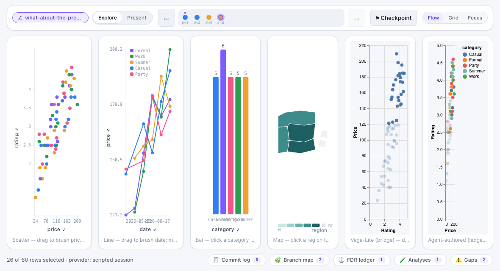
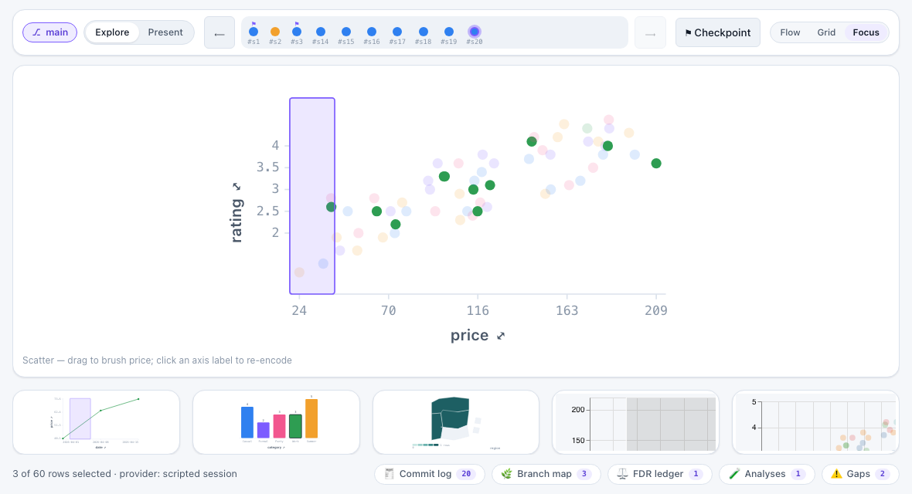
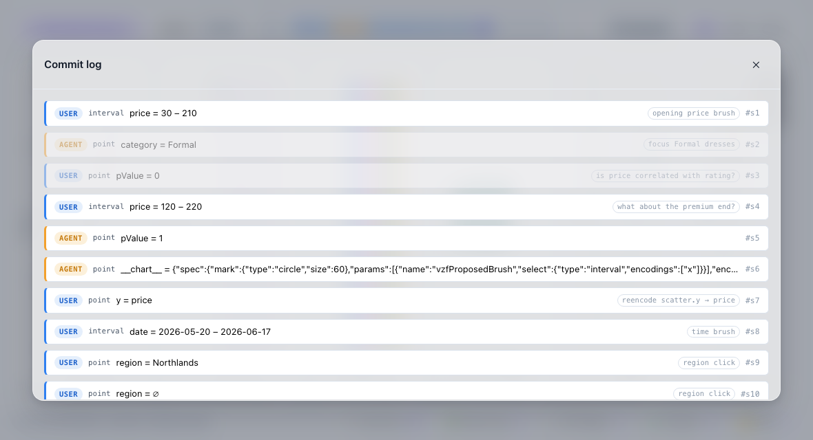
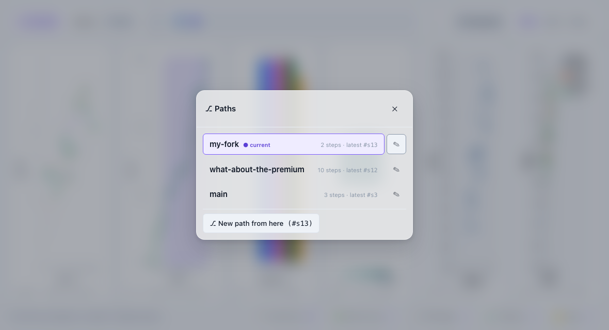
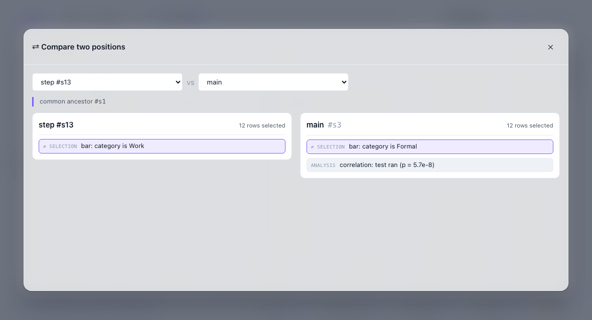
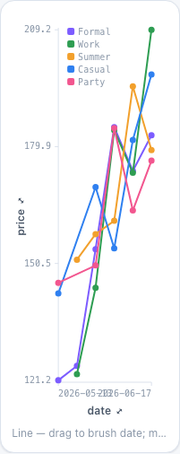
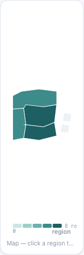

# vizfootprint-ui

The designed, reusable component library for [vizfootprint](../README.md) — a headless
session-view adapter plus React components that render a coordinated, cause-tagged,
branching-provenance dashboard: charts with interactive (re-encodable) axes, a
two-mode time-travel bar, a git-graph branch map with named paths, and the honesty
panels (commit log, online-FDR two-truths ledger, gaps, readiness).

Part of the footprintjs family (the explainable-ui / agentthinkingui pattern):
ESM + UMD bundles, React `>=18` as a peer, one stylesheet, `.d.ts` types.

```
npm run build      # dist/vizfootprint-ui.{js,umd.js,css} + types/
npm test           # vitest (jsdom units + a Playwright gallery smoke)
npm run gallery    # http://localhost:5177 — the cockpit on a scripted real session
```

## The cockpit — the flagship layout

`<VizCockpit>` puts everything on ONE screen; neither the page nor the shell
ever scrolls. Three bands:

- **top strip** — time travel: the compact `<TimeTravelBar>` (Explore/Present
  toggle, the commit timeline, and the ⚑ checkpoint button).
- **charts** — fill ALL remaining height. Each chart is a render prop that
  receives its cell's measured size (`<ChartFrame>` does the measuring), so the
  SVG viewBox matches the on-screen box 1:1 — charts scale with the window and
  stay crisp.
- **status strip** — one slim line: a status readout on the left (rows
  selected, provider label), REPORT CHIPS on the right. Each chip carries a
  live badge (commits, discoveries, gap count …) so state is glanceable while
  closed, and opens a large frosted-glass modal hosting the full panel
  (`CommitLog`, `BranchMap`, `FdrLedger`, `ReadinessPanel`, `GapsPanel` —
  unchanged). Chips are just data: add your own (e.g. a 🐛 Debug panel).



On narrow screens (≤700px) the charts become horizontally swipeable pages
(CSS scroll-snap with dot indicators); the time strip stays pinned top, the
chip strip pinned bottom — still zero vertical page scroll. The shell sizes
itself with `dvh` units so mobile browser chrome is accounted for.

```tsx
<VizCockpit
  top={<TimeTravelBar compact …adapter wiring… />}
  charts={[
    { id: 'scatter', weight: 3, caption: 'drag to brush',
      render: ({ width, height }) => <VizScatter width={width} height={height} … /> },
    { id: 'bar', weight: 2, render: ({ width, height }) => <VizBar width={width} height={height} … /> },
  ]}
  reports={[
    { id: 'commits', title: 'Commit log', icon: '🧾', badge: state.commits.length,
      content: <CommitLog commits={state.commits} onSeek={(id) => void view.seek(id)} /> },
    { id: 'gaps', title: 'Gaps', icon: '⚠️', badge: state.gaps.length,
      content: <GapsPanel heading={false} gaps={state.gaps} /> },
  ]}
  status={`${selected} of ${total} rows selected · provider: ${provider}`}
  readOnly={mode === 'present'}
/>
```

## Layouts — Flow, Grid, Focus (they time-travel)

The cockpit has three user-pickable arrangements, switched from a small
segmented control in the top strip (keyboard accessible — arrow keys walk it):

- **Flow** — the weighted band above, the default. Nothing changes if you
  never touch the switcher.
- **Grid** — equal cells in two rows. Good for comparing charts at the same
  size.
- **Focus** — one maximized chart over a rail of small live thumbnails.
  Clicking a thumbnail swaps it into the hero spot.

You can also **drag any chart by its grip** (the ⠿ that appears on hover) onto
another chart to reorder the cells. On phones (≤700px) the swipe carousel IS
the layout, so the switcher and grips hide.

The important part: **a layout change is session state, not a UI whim.** Every
preset pick, focus swap, and reorder lands through the same `navigate` verb as
a recorded commit (`layout:dashboard` — deliberately non-filtering: arranging
charts is never a data claim, exactly like pan/zoom). The session fold carries
it, so:

- seeking back in time restores the arrangement you had then;
- every named path keeps its OWN arrangement (fork freely);
- Present mode replays each story beat's layout — it never authors one;
- the commit log tells it in plain words: `layout = focus on scatter`.

Wire it in two lines — the cockpit is driven, never self-stateful:

```tsx
<VizCockpit
  layout={state.layout}                                  // the fold at the cursor
  onLayoutChange={(change) => void view.setLayout(change)} // lands a recorded commit
  …
/>
```

Morphs between arrangements animate `transform` only (FLIP via the Web
Animations API): chart internals re-render exactly once per morph — the single
`ChartFrame` remeasure — never per frame. `prefers-reduced-motion` (and any
engine without WAAPI) skips the animation and just lands the new layout.



## One modal system — VizModal

Every overlay in the library rides `<VizModal>`: the report chips, the
⚑ checkpoint prompt, and the axis `<EncodingPicker>` — no duplicate modal
systems. It is frosted glass on both themes (a translucent scrim +
`backdrop-filter` blur; the dark palette raises the scrim opacity so contrast
holds over dark content), with real dialog behavior: `role="dialog"
aria-modal`, focus moves in on open (`initialFocus` selector), Tab is trapped
at the edges, Esc / ✕ / a backdrop click close, and focus restores to the
opener. Two sizes: `'large'` (a report surface, ~min(92vw, 1100px) × 82vh) and
`'small'` (a prompt). Any overflow scrolls INSIDE `.vzf-modal-body` — never
the page.



Clicking ⚑ opens the checkpoint namer (`<CheckpointModal>`): one autofocused
field, Enter/Save commits through the adapter's `checkpoint` action, and the
prompt shows which commit the flag will mark.

## Named paths — branching you can read

Your work is a story that can branch: seek back in time, act, and the session
starts a second line of work — now with a NAME (like branches in git, but in
plain words). The `branches/` component family makes that loop visible:

- **`<BranchPill>`** — the always-visible "which path am I on?" chip, made for
  the time bar's `pathPill` slot (it sits beside Explore/Present). Violet with
  the path's name while you are on one; amber "viewing past" while you have
  travelled back (acting there starts a new path automatically); quiet before
  the first step. Clicking it opens the Paths list.
- **`<PathsModal>`** — every named path: step count, latest commit, a "current"
  marker. Click one to switch to it. Rename inline with ✎. "New path from
  here" forks at the cursor. In Present mode the list is view-only.
- **`<CompareModal>`** — two positions side by side: the common-ancestor line
  on top, each side's row count, and every difference as a plain-language chip
  ("bar: category is Work" vs "bar: category is Formal"; "correlation: test
  ran (p = 0.004)" only on the side that ran it). An empty diff says
  "identical since #x" — and a rejected compare shows its reason.
- **`<ForkToast>`** — a small notice when acting from the past forks a new
  path: *"Forked a new path 'bar-click' — your previous story is safe in
  Paths."* Non-blocking, dismissible, auto-hides, respects reduced motion.
  Mount it in the cockpit's `toast` slot.
- **`<BranchMap>` upgrades** — pass `paths` and each lane wears its path's
  name; pass the action callbacks and clicking a commit opens a small glass
  menu: *Jump here · New path here · Bring this step over · Undo this step ·
  Compare with current*. Actions that cannot apply are disabled **with the
  reason** (an analysis can't be un-run — the FDR ledger never refunds alpha).





The adapter carries it all: `state.paths` (the list, the current path or the
detached position, and the journal the toast watches) plus the actions
`switchPath` / `renamePath` / `newPathAt` / `compare` / `bringOver` / `undo`.
A brought-over step lands as an ordinary commit whose chip in the CommitLog
says `↷ brought over from #x` (an undo says `⎌ undoes #x`, and a conflicting
override wears `⚠ n overridden`) — the story survives in the log itself.

Over a polled server, the actions POST to their own endpoints (all
overridable via `pollingSource({ endpoints })`): `/api/paths` (body
`{action: 'switch'|'rename'|'new', …}`), `/api/compare` (`{a, b}` — responds
with the session's `compare()` JSON), `/api/bring-over` and `/api/undo`
(`{commitId}`), while `/api/state` gains a `paths` slice.

## VizLine — brush a time range

Drag horizontally across the line chart and you select a TIME RANGE: the chart
emits the range as two ISO dates (`['2026-04-01', '2026-06-17']`) on its date
field, the session lands one filter commit, and every other chart narrows to
the rows inside that window. A short click clears the range. The emitted
bounds are snapped to dates that actually exist in the data, so the filter
never names a day the data does not have.

The chart takes RAW rows and draws the **mean of the value column per date**
(per series, when a series field is set — one coloured line per category, with
a small legend). The mean, not the sum: under a crossfilter the number of rows
per date changes, and a sum would confuse "fewer rows" with "smaller values".

Both axis labels are pickers, and they are honest about what fits: the **x
picker offers only date columns** and the **y picker only numeric ones** — an
incompatible column is disabled with the reason written on it, exactly like
the scatter's pickers.



## VizMap — click a region

A self-contained SVG region map (choropleth): pass a GeoJSON
`FeatureCollection` (each feature carries its region name), name the data
column those regions live in, and give it one value per region — typically
the row count under the current crossfilter. No map tiles, no map library;
the features are projected with a simple fitted equirectangular projection
(fine for regional maps; it does not pretend to be world-scale cartography).

Click a region to select it — the map emits the region name as a point
selection on your region column and the other charts narrow to it. The
selected region wears the selection outline; **click it again to clear**.
Regions are keyboard-reachable (Tab to a region, Enter selects) and each one
announces its name and value to screen readers.

Colour is a five-step teal ramp — light means few rows, deep means many, with
its own dark-theme steps (on dark, MORE rows = brighter). The legend shows the
0→max range. A region with NO rows is honestly different: a neutral fill with
a dashed edge and a "no rows under the current selection" note — absence is
never dressed up as "low".



## VizTable — sort, click a row to select

A sortable HTML table over the crossfiltered rows. Click a column header to
sort it — the first click is ascending, the second descending, the third
clears back to the input order (an arrow glyph and `aria-sort` track the
live state). Click a row to select it by the table's id field; **click it
again to clear** — the same gesture as `VizBar`/`VizMap`.

**Selection semantics (design call): dim, never hide.** `selection` is the
exact clause-addressable fold `VizScatter` takes (see the renderer contract
below) — a row failing the OTHER views' clauses gets a dimmed style, it is
never removed, and the table's own clause never dims the table.
`VizBar`/`VizMap` instead recompute their data (a count per category/region)
under a crossfilter; a table has no aggregate to recompute, only real rows,
so it follows the scatter's precedent instead. Hiding rows would also make
sorted row POSITIONS jump around as some other view's selection changes —
surprising for a component whose whole point is a stable, scannable order.
Dimming keeps every row addressable (still clickable, still sortable) while
making "what's currently included" honest.

Numeric cells render right-aligned in the shared monospace/tabular-nums
style so digits line up in a column. Rows are keyboard-reachable (Tab to a
row, Enter selects); an empty table says so plainly ("no rows to show")
rather than rendering a blank card. The consumer decides which columns to
show (`columns`) — the chart never guesses a "sane" count from the data.

```tsx
<VizTable
  viewId="table"
  data={rows}
  columns={['category', 'price', 'rating']}
  idField="id"
  selection={selectionForView(state.selections, 'table')}
  onEmit={(e) => void view.emit('table', e)}
/>
```

## The renderer contract — a versioned protocol

Any charting stack — the five first-party charts, a canvas renderer, a
wrapped external library — can join the coordinated, cause-tagged dashboard
by implementing ONE small surface. The protocol is framework-agnostic and
versioned (`RENDERER_PROTOCOL_VERSION`, currently `1.0`).

**The handshake.** The host calls `renderer.mount(el, handshake)`; the
handshake carries the protocol version the host speaks, the `viewId`, and the
four callbacks. The renderer answers with a hello: the version IT speaks, its
honest capabilities (`canBrush`, `canPointSelect`, `canHighlight`,
`canReencode`, `canPanZoom`, optional `canRearrange`, and which
`emissionKinds` it produces), and any internal data transforms it declares.
`bindRenderer` guards the hello — a refused bind is a **typed gap**, never a
silent no-op:

- **version mismatch** → `protocol-version-mismatch`. The policy: two sides
  bind iff they speak the same MAJOR; a minor difference is compatible (minor
  revisions only add optional fields); a major mismatch refuses to bind.
- **declared transforms** → `transforms-not-owned`. The HOST owns every
  bin/aggregate/decimate; rows arrive prepared (the bar renderer receives one
  row per category with its count — it never counts).

**Inbound: `update(RenderState)`.** One object per frame: `rows` (already
crossfiltered/decimated/aggregated by the host), `encodings` (the
channel→field fold at the cursor), the **clause-addressable `selection`**,
ephemeral `hover` keys, `theme` tokens, and the measured `size`.

The selection is the load-bearing piece: `{ clauses, resolve, selfClauseId }`,
where `clauses` maps each SOURCE viewId to its live clause (kind, field,
value, and a ready row predicate). A renderer can therefore implement "dim
under everyone's brush but my own" with no side channel — skip its own entry,
fold the rest. The host derives it straight from the adapter state's per-view
commit fold:

```ts
import { selectionForView, keepPredicate } from 'vizfootprint-ui';

const selection = selectionForView(state.selections, 'scatter'); // self named for exclusion
const keep = keepPredicate(selection);        // everyone's clauses but my own
const keepAll = keepPredicate(selectionForView(state.selections, null)); // the whole-dashboard truth
```

The predicates mirror the engine's own evaluator (`src/data` `matchesClause`)
and the mirror is pinned by a parity test. One tier note, also pinned: a
cleared POINT selection arrives as `null` at the adapter tier (the session
projects it that way and JSON cannot carry `undefined`), so a nullish point
value here always means "cleared".

**Outbound: exactly four verbs.** A renderer's entire voice:

| verb | meaning |
|---|---|
| `emit(emission)` | a selection gesture — the unchanged R3 `{ rawValue, encoding }` shape in DATA space; the renderer never builds a clause |
| `hover(keys \| null)` | ephemeral hover keys; never committed |
| `reencodeRequest(channel)` | ask the host to re-encode a channel — the HOST owns the picker and the `reencode` verb |
| `navigate(viewState)` | record a pan/zoom view state — lands as the `navigate` dispatch verb, deliberately NON-filtering (a viewport is not a data claim) |

Navigation is capability-guarded on both sides: a renderer that declares
`canPanZoom: false` and receives a zoom gesture files nothing; a HOST asking
to navigate a non-capable view lands a typed `navigate-unsupported` gap
(`bound.navigate(...)` refuses and nothing is recorded).

**Reference implementations.** All five first-party charts ship as contract
renderers — `scatterRenderer()`, `lineRenderer()`, `barRenderer()`,
`mapRenderer({ geo })`, `tableRenderer({ columns })` — built on one generic
`reactRenderer` bridge (mount a root, render synchronously, theme tokens on
the `.vzf` wrapper). Their React props remain a thin convenience layer over
the same contract types.

**Conformance kit v0.** `runConformance(plan)` mounts ANY renderer against a
real scripted session and walks the full loop in order — version-guard,
transform-ownership, handshake, renders, gesture-emits, commit-lands (origin
in the cause), crossfilter-returns (the view's own clause addressable + a
visible re-render), navigate (recorded + non-filtering, or the typed gap),
unmount — and reports every step in plain words. All five first-party charts
pass it in CI; a bestiary of hostile renderers proves the kit catches each
violation at the exact step.

## The layers (each importable alone)

| module | job |
|---|---|
| `tokens/` | design tokens + theme engine — scoped CSS variables on the `.vzf` root (never `:root`), light+dark via `prefers-color-scheme` with a `data-theme` override that wins both ways |
| `adapter/` | `createSessionView(source)` — the framework-light store (getState/subscribe + action methods incl. `navigate`) over EITHER a live `InteractionSession` (`sessionSource`) OR a polled `/api/state` endpoint (`pollingSource`); React binds via `useSessionView` |
| `contract/` | the versioned renderer protocol (see above): `RENDERER_PROTOCOL_VERSION`, `bindRenderer` + typed gaps, `selectionForView`/`keepPredicate`, the five reference renderers, `runConformance` |
| `layout/` | `<VizCockpit>` (the flagship — and only — single-screen shell) + `<VizModal>` (the one modal system) + `<VizPanel>`/`<VizCard>` |
| `charts/` | `<VizScatter>`, `<VizBar>`, `<VizLine>` (time series, date brush), `<VizMap>` (SVG choropleth, region click), `<VizTable>` (sortable rows, click-to-select) — controlled; emit the R3 `{rawValue, encoding}` shape (charts never build clauses); dimming/outlines ride the contract's clause-addressable `selection`; `<ChartFrame>` measures a cell so charts fill it; axis labels open `<EncodingPicker>` (on VizModal; disabled-with-reason) firing `onReencode(viewId, channel, field)` — or ask the HOST via `onReencodeRequest(channel)` in contract mode |
| `time/` | `<TimeTravelBar>` with `explore` (full commit timeline + fork-safe ⟵/⟶ step rules, `compact` for the cockpit) and `present` (checkpoint-ONLY story beats, acting disabled, `onReadOnlyChange` up to the shell) + `<CheckpointModal>` + `<BranchMap>` |
| `panels/` | `<CommitLog>` (cause badges, click-to-seek, off-branch dimming), `<FdrLedger>` (two truths + the verbatim honesty line), `<GapsPanel>`, `<ReadinessPanel>` — cockpit hosts these inside report modals, unchanged |

## Quick start

```tsx
import {
  VizCockpit, VizScatter, TimeTravelBar, CommitLog, FdrLedger,
  createSessionView, sessionSource, useSessionView,
} from 'vizfootprint-ui';
import 'vizfootprint-ui/styles.css';

const view = createSessionView(sessionSource(session), { as: 'user' }); // or pollingSource()

function App() {
  const state = useSessionView(view);
  return (
    <VizCockpit
      top={<TimeTravelBar compact
        commits={state.commits} cursor={state.cursor} head={state.head}
        checkpoints={state.checkpoints} onSeek={(id) => void view.seek(id)}
        onCheckpoint={(label) => void view.checkpoint(label)} />}
      charts={[{ id: 'scatter', render: ({ width, height }) => (
        <VizScatter width={width} height={height} data={points}
          columns={state.columns[state.defaultTable]}
          onEmit={(e) => void view.emit('scatter', e)}
          onReencode={(v, c, f) => void view.reencode(v, c, f)} />) }]}
      reports={[
        { id: 'commits', title: 'Commit log', badge: state.commits.length,
          content: <CommitLog commits={state.commits} onSeek={(id) => void view.seek(id)} /> },
        { id: 'ledger', title: 'FDR ledger', badge: state.ledger.discoveries,
          content: <FdrLedger ledger={state.ledger} /> },
      ]}
      status={`cursor ${state.cursor ?? '—'}`}
    />
  );
}
```

## CSS scoping — and its honest limit

Every rule is scoped under the root class `.vzf` at **zero specificity**
(`:where(.vzf …)`), and theme variables land on the component's own element,
so nothing leaks **out** into the host app and two dashboards can wear
different brands on one page. The flip side (the same limitation
agentthinkingui documents): host **global** rules — a bare `button { … }`, a
utility framework's resets — still leak **in**, because `:where()` cannot
out-specify them. A consumer needing hard isolation should mount the dashboard
inside an iframe (a real document boundary); CSS alone cannot promise it.

## Present mode semantics

`present` is the read-only storytelling mode: prev/next traverse only the
**named checkpoints** (in checkpoint order), the current beat's title renders
large, ordinary commits are hidden, the checkpoint composer disappears, and the
bar reports `readOnly` upward so the shell dims and pointer-blocks the acting
surfaces (the cockpit dims its charts band; navigation and the read-only report
chips stay live). The current beat is the checkpoint at the cursor, or — when
the cursor sits between beats — the most recent beat on the cursor's own
lineage.
